# 👋 Hi, I'm Abhay Chaudhary

### Aspiring Software Developer | CSE Student — Graphics & Gaming

📍 Dehradun, Uttarakhand, India  
🎓 B.Tech CSE, UPES Dehradun

I'm passionate about **game development, UI/UX design, and 3D graphics**. I enjoy exploring creative technology and building projects that combine design and development.

---

## 🚀 About Me

---

## 🛠️ Skills & Technology

---

## 🪪 Developer ID

---

## 💻 Selected Projects

| Project | Link |
|---|---|
| Mnemosyne | [View Project](https://mnemosyne-eosin.vercel.app/) |
| Vendor Plus | [View Project](https://vendorplus.online/) |
| Geometry Dash Game | [Play Game](https://abhay122710.itch.io/geometry-dash-game) |

---

## 🤝 Connect With Me

- **GitHub:** [abhay122710](https://github.com/abhay122710)

---

  <i>Building, learning, and creating through code.</i>

